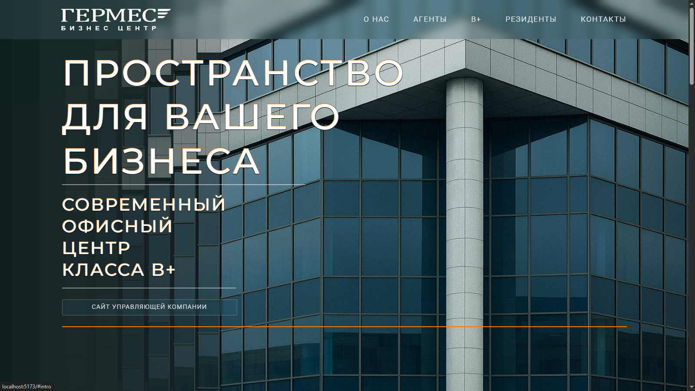
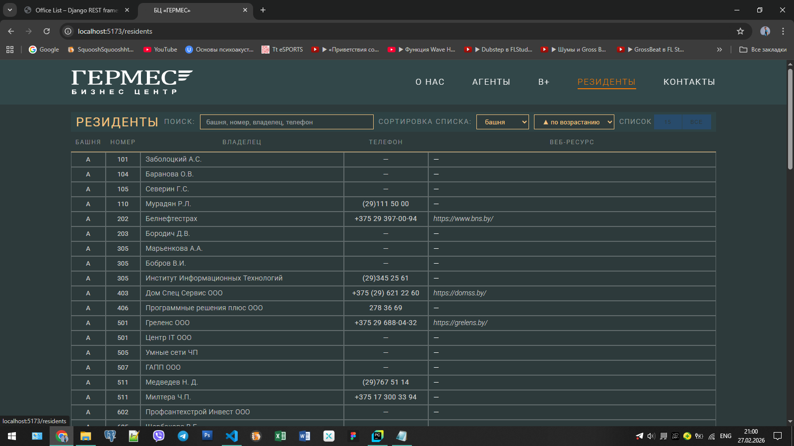
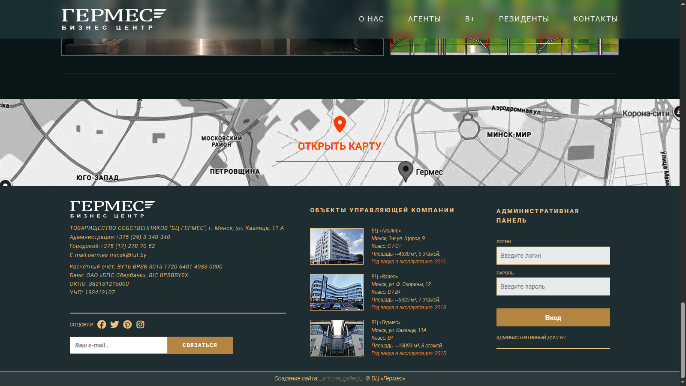
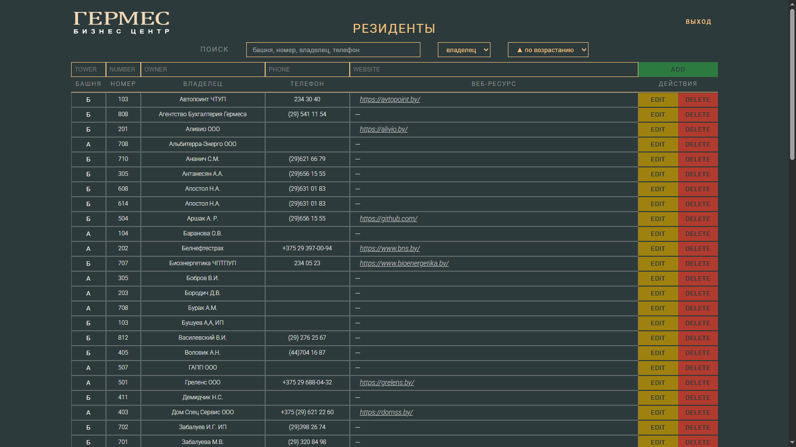

# Hermes Directory (Business Center "ГЕРМЕС")

Fullstack учебный проект: публичный справочник арендаторов бизнес-центра + JWT-защищённая админ-панель для управления офисами.

---

## 🚀 Stack

- Django REST Framework
- SimpleJWT (JWT authentication)
- React (Vite)
- Axios
- SQLite (dev)

---

## 📌 Возможности

### Публичная часть (без авторизации)

- Список офисов (номер, корпус/башня, арендатор, телефон, сайт)
- Поиск по любому полю (номер / компания / телефон / корпус / сайт)
- Фильтрация по корпусу
- Сортировка таблицы
- Адаптивное отображение

### Админ-панель (JWT)

- Авторизация (login / refresh / me)
- CRUD операции с офисами
- Доступ к изменениям только для авторизованных пользователей

---

## 🏗 Архитектура

```
React (Vite)
        ↓
      Axios
        ↓
Django REST API
        ↓
       ORM
        ↓
     SQLite
```

### Основные эндпоинты

- `GET /api/offices/`
- `POST /api/auth/login/`
- `POST /api/auth/refresh/`
- `GET /api/auth/me/`

---

## ⚙ Быстрый старт (локально)

### Backend

```bash
cd hermes_directory_backend
python -m venv venv

# Windows
venv\Scripts\activate

# macOS/Linux
# source venv/bin/activate

pip install -r requirements.txt
python manage.py migrate
python manage.py createsuperuser
python manage.py runserver 0.0.0.0:8000
```

Backend будет доступен по адресу:
```
http://localhost:8000
```

---

### Frontend

```bash
cd hermes_directory_frontend
npm install
npm run dev -- --host
```

Frontend будет доступен по адресу:
```
http://localhost:5173
```

---

## 🖼 Screenshots

### Landing


---

### Residents Directory


---

### Admin Login


---

### Admin Panel


---

## 📈 Возможные улучшения

- SEO (meta-tags, sitemap, prerender)
- Полная мобильная адаптация
- PostgreSQL вместо SQLite
- Docker + Nginx
- Production deployment

---

## 🎯 Назначение проекта

Проект демонстрирует:

- REST API на Django
- JWT-авторизацию
- Разделение публичной и приватной зоны
- SPA на React
- Реалистичный бизнес-кейс (внутренний инструмент бизнес-центра)
